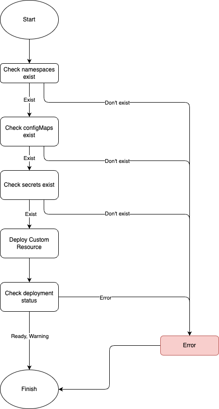

# Custom Resource Definitions (CRDs)

## Table of Contents

- [Companion Manager CR](#companion-manager-cr)
  - [Specification](#specification)
- [Deployment steps](#deployment-steps)
- [CRD Requirements](#crd-requirements)
- [CRD Options](#crd-options)
  - [1. All fields are hardcoded in the CRD.](#1-all-fields-are-hardcoded-in-the-crd)
  - [2. Namespaces are configurable.](#2-namespaces-are-configurable)
  - [3. Namespaces, ConfigMaps, and Secrets are configurable.](#3-namespaces-configmaps-and-secrets-are-configurable)
  - [4. Namespaces, ConfigMaps, Secrets and ContainerPort are configurable.](#4-namespaces-configmaps-secrets-and-containerport-are-configurable)
  - [5. Namespaces, ConfigMaps, Secrets, ContainerPort, and Resources (requested, limit) are configurable.](#5-namespaces-configmaps-secrets-containerport-and-resources-requested-limit-are-configurable)
  - [6. Namespaces, ConfigMaps, Secrets, ContainerPort, Resources (requested, limit), and Replicas are configurable.](#6-namespaces-configmaps-secrets-containerport-resources-requested-limit-and-replicas-are-configurable)
  - [7. Namespaces, ConfigMaps, Secrets, Resources (requested, limit), and Replicas are configurable.](#7-namespaces-configmaps-secrets-resources-requested-limit-and-replicas-are-configurable)
  - [8. Namespaces, ConfigMaps, Secrets, Resources (requested, limit), Replicas, Annotations, and Labels are configurable.](#8-namespaces-configmaps-secrets-resources-requested-limit-replicas-annotations-and-labels-are-configurable)
- [Conclusion - Suggestion for the CRD](#conclusion---suggestion-for-the-crd)
  - [Sample manifest](#sample-manifest)
- [Other](#other)
  - [Default values](#default-values)
  - [Status.state](#statusstate)

## Companion Manager CR

The Companion Manager CR (Custom Resource) is the companion backend in Kyma.

### Specification

The Companion Manager CR has the following fields:

- `name`: The name of the companion application.
- `namespace`: The namespace in which the companion application is deployed.
- `deplyomentName`: The name of the deployment for the companion application.
- `replicas`: The number of replicas for the companion application.
- `image`: The Docker image of the companion application.
- `imagePullSecrets`: The name of the secret to be used for pulling the Docker image.
- `imagePullPolicy`: The policy for pulling the Docker image.
- `ports`: The ports to be exposed by the companion application.
- `resources`: The resource limits and requests for the companion application. (CPU and memory)
- `env`: Environment variables to be passed to the companion application. Source are configMap and secret.
- `labels`: Labels to be applied to the companion application.
- `annotations`: Annotations to be applied to the companion application.
- `serviceAccount`: The service account to be used by the companion application.
- `serviceAccountName`: The name of the service account to be used by the companion application.
- `restartPolicy`: The restart policy for the companion application.

## Deployment steps

This is a very high level overview of the deployment steps. This is not a detailed deployment guide.



## CRD Requirements

From configuration perspective, not all fields are mandatory. The only mandatory fields depend on the following conditions:

- Flexibility
- Easy to deploy
- Easy to maintain
- Automation support

From this reason we should define the best Custom Resource Definition (CRD) for the Companion Manager CR.


## CRD Options

We could use the following CRD (Custom Resource Definition) options for the Companion Manager CR.

### 1. All fields are hardcoded in the CRD.

The user cannot change any field.

[config/crd/bases/1-operator.kyma-project.io_companions.yaml](config/crd/bases/1-operator.kyma-project.io_companions.yaml)

```yaml
properties:
```

### 2. Namespaces are configurable.

The user can change the namespaces in which are required for the companion application. (SAP AI Core, Redis, Hana Cloud) User also can change the deployment namespace.

[config/crd/bases/2-operator.kyma-project.io_companions.yaml](config/crd/bases/2-operator.kyma-project.io_companions.yaml)

```yaml
properties:
  deploymentNamespace:
    type: string
  namespaces:
    items:
      type: string
    type: array
required:
  - deploymentNamespace
  - namespaces
type: object
```

### 3. Namespaces, ConfigMaps, and Secrets are configurable.

The user can change the namespaces in which are required for the companion application. (SAP AI Core, Redis, Hana Cloud) User also can change the deployment namespace, ConfigMaps, and Secrets.

[config/crd/bases/c3-operator.kyma-project.io_companions.yaml](config/crd/bases/3-operator.kyma-project.io_companions.yaml)

```yaml
properties:
  configMapNames:
    items:
      type: string
    type: array
  deploymentNamespace:
    type: string
  namespaces:
    items:
      type: string
    type: array
  secretNames:
    items:
      type: string
    type: array
required:
  - configMapNames
  - deploymentNamespace
  - namespaces
  - secretNames
type: object
```

### 4. Namespaces, ConfigMaps, Secrets and ContainerPort are configurable.

The user can change the namespaces in which are required for the companion application. (SAP AI Core, Redis, Hana Cloud) User also can change the deployment namespace, ConfigMaps, Secrets, and ContainerPort.

[config/crd/bases/4-operator.kyma-project.io_companions.yaml](config/crd/bases/4-operator.kyma-project.io_companions.yaml)

```yaml
properties:
  configMapNames:
    items:
      type: string
    type: array
  containerPort:
    format: int32
    type: integer
  deploymentNamespace:
    type: string
  namespaces:
    items:
      type: string
    type: array
  secretNames:
    items:
      type: string
    type: array
required:
  - configMapNames
  - containerPort
  - deploymentNamespace
  - namespaces
  - secretNames
type: object
```

### 5. Namespaces, ConfigMaps, Secrets, ContainerPort, and Resources (requested, limit) are configurable.

The user can change the namespaces in which are required for the companion application. (SAP AI Core, Redis, Hana Cloud) User also can change the deployment namespace, ConfigMaps, Secrets, ContainerPort, and Resources (requested, limit).

[config/crd/bases/5-operator.kyma-project.io_companions.yaml](config/crd/bases/5-operator.kyma-project.io_companions.yaml)

```yaml
properties:
  configMapNames:
    items:
      type: string
    type: array
  containerPort:
    format: int32
    type: integer
  deploymentNamespace:
    type: string
  namespaces:
    items:
      type: string
    type: array
  resources:
    description: ResourceRequirements defines the CPU and Memory requirements
      for the resources.
    properties:
      limits:
        description: ResourceValues defines the CPU and Memory values
          for the resources.
        properties:
          cpu:
            type: string
          memory:
            type: string
        required:
          - cpu
          - memory
        type: object
      requests:
        description: ResourceValues defines the CPU and Memory values
          for the resources.
        properties:
          cpu:
            type: string
          memory:
            type: string
        required:
          - cpu
          - memory
        type: object
    required:
      - limits
      - requests
    type: object
  secretNames:
    items:
      type: string
    type: array
required:
  - configMapNames
  - containerPort
  - deploymentNamespace
  - namespaces
  - resources
  - secretNames
type: object
```

### 6. Namespaces, ConfigMaps, Secrets, ContainerPort, Resources (requested, limit), and Replicas are configurable.

The user can change the namespaces in which are required for the companion application. (SAP AI Core, Redis, Hana Cloud) User also can change the deployment namespace, ConfigMaps, Secrets, ContainerPort, Resources (requested, limit), and Replicas.

[config/crd/bases/6-operator.kyma-project.io_companions.yaml](config/crd/bases/6-operator.kyma-project.io_companions.yaml)

```yaml
properties:
  configMapNames:
    description: Required ConfigMaps names
    items:
      type: string
    type: array
  containerPort:
    description: Container port for the companion backend. Default value
      is 5000.
    format: int32
    type: integer
  deploymentNamespace:
    description: Namespace where the deployment will be created.
    type: string
  namespaces:
    description: |-
      List of namespaces which are prerequisites for the Kyma companion manager.
      Defaults:
      - 'ai-core': Main namespace. Namespace for the SAP AI Core component.
      - 'hana-cloud': Namespace for the SAP HANA Cloud vector instance.
      - 'redis': Namespace for the Redis.
    items:
      type: string
    type: array
  replicas:
    description: Replica count for the companion backend. Default value
      is 1.
    format: int32
    type: integer
  resources:
    description: |-
      Specify required resources and resource limits for the companion backend.
      Example:
      resources:
        limits:
          cpu: 1
          memory: 1Gi
        requests:
          cpu: 500m
          memory: 256Mi
    properties:
      limits:
        description: ResourceValues defines the CPU and Memory values
          for the resources.
        properties:
          cpu:
            type: string
          memory:
            type: string
        required:
          - cpu
          - memory
        type: object
      requests:
        description: ResourceValues defines the CPU and Memory values
          for the resources.
        properties:
          cpu:
            type: string
          memory:
            type: string
        required:
          - cpu
          - memory
        type: object
    required:
      - limits
      - requests
    type: object
  secretNames:
    description: Required Secrets names
    items:
      type: string
    type: array
required:
  - configMapNames
  - containerPort
  - deploymentNamespace
  - namespaces
  - replicas
  - resources
  - secretNames
type: object
```

### 7. Namespaces, ConfigMaps, Secrets, Resources (requested, limit), and Replicas are configurable.

The user can change the namespaces in which are required for the companion application. (SAP AI Core, Redis, Hana Cloud) User also can change the deployment namespace, ConfigMaps, Secrets, Resources (requested, limit), and Replicas.

[config/crd/bases/7-operator.kyma-project.io_companions.yaml](config/crd/bases/7-operator.kyma-project.io_companions.yaml)

```yaml
properties:
  configMapNames:
    description: Required ConfigMaps names
    items:
      type: string
    type: array
  deploymentNamespace:
    default:
      deploymentNamespace: ai-core
    description: Namespace where the deployment will be created.
    type: string
  namespaces:
    default:
      namespaces:
        - ai-core
        - hana-cloud
        - redis
    description: |-
      List of namespaces which are prerequisites for the Kyma companion manager.
      Defaults:
      - 'ai-core': Main namespace. Namespace for the SAP AI Core component.
      - 'hana-cloud': Namespace for the SAP HANA Cloud vector instance.
      - 'redis': Namespace for the Redis.
    items:
      type: string
    type: array
  replicas:
    default:
      replicas: 1
    description: Replica count for the companion backend. Default value
      is 1.
    format: int32
    type: integer
  resources:
    default:
      resources:
        limits:
          cpu: "4"
          memory: 4Gi
        requests:
          cpu: 500m
          memory: 256Mi
    description: |-
      Specify required resources and resource limits for the companion backend.
      Example:
      resources:
        limits:
          cpu: 1
          memory: 1Gi
        requests:
          cpu: 500m
          memory: 256Mi
    properties:
      limits:
        description: ResourceValues defines the CPU and Memory values
          for the resources.
        properties:
          cpu:
            type: string
          memory:
            type: string
        required:
          - cpu
          - memory
        type: object
      requests:
        description: ResourceValues defines the CPU and Memory values
          for the resources.
        properties:
          cpu:
            type: string
          memory:
            type: string
        required:
          - cpu
          - memory
        type: object
    required:
      - limits
      - requests
    type: object
  secretNames:
    description: Required Secrets names
    items:
      type: string
    type: array
required:
  - configMapNames
  - deploymentNamespace
  - namespaces
  - replicas
  - resources
  - secretNames
type: object
```

### 8. Namespaces, ConfigMaps, Secrets, Resources (requested, limit), Replicas, Annotations, and Labels are configurable.

The user can change the namespaces in which are required for the companion application. (SAP AI Core, Redis, Hana Cloud) User also can change the deployment namespace, ConfigMaps, Secrets, Resources (requested, limit), Replicas, Annotations, and Labels.

[config/crd/bases/8-operator.kyma-project.io_companions.yaml](config/crd/bases/8-operator.kyma-project.io_companions.yaml)

```yaml
properties:
  annotations:
    additionalProperties:
      type: string
    description: Annotations allows to add annotations to NATS.
    type: object
  configMapNames:
    description: Required ConfigMaps names
    items:
      type: string
    type: array
  deploymentNamespace:
    default:
      deploymentNamespace: ai-core
    description: Namespace where the deployment will be created.
    type: string
  labels:
    additionalProperties:
      type: string
    description: Labels allows to add Labels to NATS.
    type: object
  namespaces:
    default:
      namespaces:
        - ai-core
        - hana-cloud
        - redis
    description: |-
      List of namespaces which are prerequisites for the Kyma companion manager.
      Defaults:
      - 'ai-core': Main namespace. Namespace for the SAP AI Core component.
      - 'hana-cloud': Namespace for the SAP HANA Cloud vector instance.
      - 'redis': Namespace for the Redis.
    items:
      type: string
    type: array
  replicas:
    default:
      replicas: 1
    description: Replica count for the companion backend. Default value
      is 1.
    format: int32
    type: integer
  resources:
    default:
      resources:
        limits:
          cpu: "4"
          memory: 4Gi
        requests:
          cpu: 500m
          memory: 256Mi
    description: |-
      Specify required resources and resource limits for the companion backend.
      Example:
      resources:
        limits:
          cpu: 1
          memory: 1Gi
        requests:
          cpu: 500m
          memory: 256Mi
    properties:
      limits:
        description: ResourceValues defines the CPU and Memory values
          for the resources.
        properties:
          cpu:
            type: string
          memory:
            type: string
        required:
          - cpu
          - memory
        type: object
      requests:
        description: ResourceValues defines the CPU and Memory values
          for the resources.
        properties:
          cpu:
            type: string
          memory:
            type: string
        required:
          - cpu
          - memory
        type: object
    required:
      - limits
      - requests
    type: object
  secretNames:
    description: Required Secrets names
    items:
      type: string
    type: array
required:
  - configMapNames
  - deploymentNamespace
  - namespaces
  - replicas
  - resources
  - secretNames
type: object
```

## Conclusion - Suggestion for the CRD

The best option is the option 7 or 8. These provide the most flexibility for the user. The user can change the most important fields for the companion application, which ensures to be easy to deploy, easy to maintain, and automation support.

Accordingly the user can change the following fields:

- Resources (requested, limit. Accordingly the resource parameters can be changed depending on the load)
- Replicas (According to the load or usage, the user can change the number of replicas)
- Namespaces (check if the namespaces are available)
- Deployment namespace (in this case, the user can deploy the companion application in a different namespace)
- ConfigMaps (check if the ConfigMaps are available)
- Secrets (check if the Secrets are available)
- Annotations (add annotations to the companion application) - in option 8
- Labels (add labels to the companion application) - in option 8

### Sample manifest

[config/samples/default.yaml](config/samples/default.yaml)

```yaml
apiVersion: operator.kyma-project.io/v1alpha1
kind: Companion
metadata:
  labels:
    app.kubernetes.io/name: default
    app.kubernetes.io/component: kyma-companion-manager
    app.kubernetes.io/part-of: kyma-companion-manager
  name: default
  namespace: kyma-system
spec:
  namespaces:
    - redis
    - hana-cloud
    - ai-core
  deploymentNamespace: ai-core
  configMapNames:
    - ai-backend-config
  secretNames:
    - ai-core
    - ai-ghcr-login-secret
  replicas: 2
  resources:
    limits:
      cpu: 4
      memory: 4Gi
    requests:
      cpu: 500m
      memory: 256Mi
```

## Other

### Default values

In the final CRD, we should define the default values for the fields. The default values should be defined in the CRD.

### Status.state

Kyma modules should provide the `status.state`, because the Lifecycle Manager then updates the Kyma CR of the cluster based on the observed status changes in the module CR (similar to a native Kubernetes deployment tracking availability).

https://github.com/kyma-project/lifecycle-manager/blob/main/docs/modularization.md

```yaml
          status:
            description: CompanionStatus defines the observed state of Companion.
            properties:
              configMapsData:
                additionalProperties:
                  additionalProperties:
                    type: string
                  type: object
                description: 'ConfigMapsData: Map of ConfigMaps and their data. (optional)'
                type: object
              configMapsExists:
                additionalProperties:
                  type: boolean
                description: 'ConfigMapsExists: Map of ConfigMaps and their existence
                  status.'
                type: object
              namespacesExist:
                additionalProperties:
                  type: boolean
                description: |-
                  Result of prerequisites validation.
                  NamespacesExist: Map of namespaces and their existence status.
                type: object
              secretsData:
                additionalProperties:
                  additionalProperties:
                    format: byte
                    type: string
                  type: object
                description: 'SecretsData: Map of Secrets and their data. (optional)'
                type: object
              secretsExists:
                additionalProperties:
                  type: boolean
                description: 'SecretsExists: Map of Secrets and their existence status.'
                type: object
              state:
                description: |-
                  Defines the overall state of the Companion custom resource.<br/>
                  - `Ready` when all the resources managed by the Kyma companion manager are deployed successfully and
                  the companion backend is ready.<br/>
                  - `Warning` if there is a user input misconfiguration.<br/>
                  - `Processing` if the resources managed by the Kyma companion manager are being created or updated.<br/>
                  - `Error` if an error occurred while reconciling the Companion custom resource.
                  - `Deleting` if the resources managed by the Kyma companion manager are being deleted.
                type: string
            required:
            - configMapsExists
            - namespacesExist
            - secretsExists
            - state
            type: object
        type: object
```
